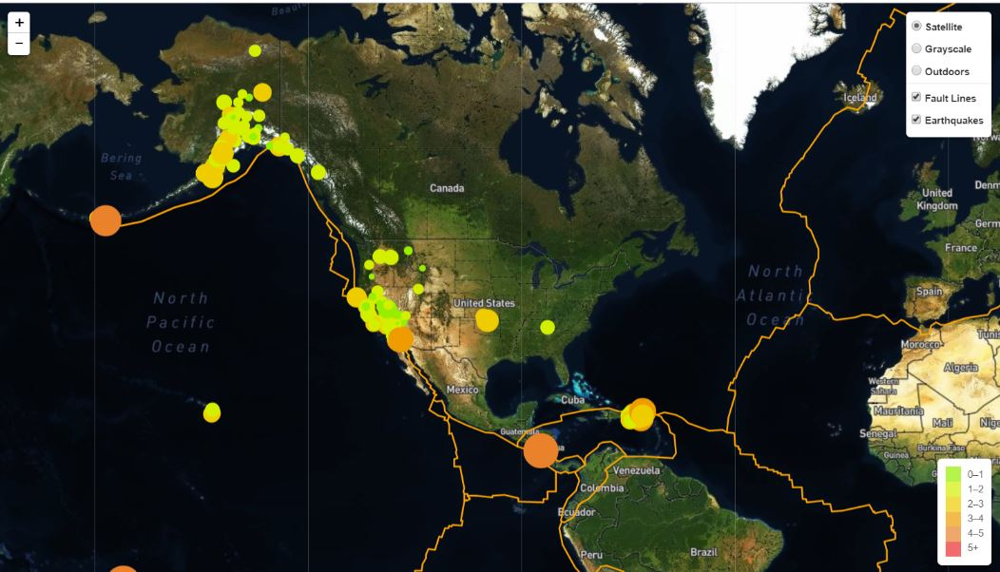

# Visualizing Data with Leaflet
 
 
 
The USGS provides earthquake data in a number of different formats, updated every 5 minutes. I grabbed the last 7 days earth quake data from the USGS GeoJSON Feed page and created a ligth and dark map with leaflet.

